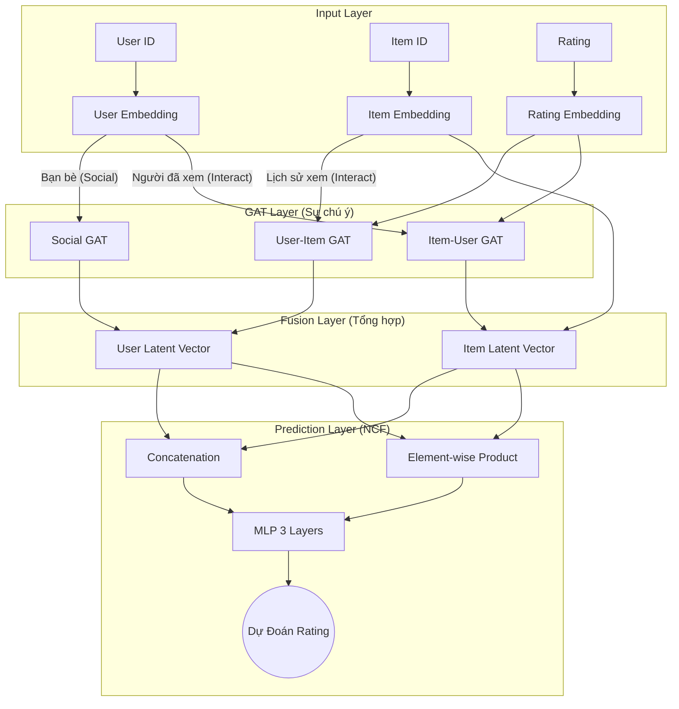
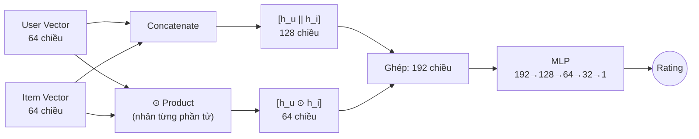

# Tài Liệu Kỹ Thuật Chi Tiết (GAT-NSR)

Tài liệu này giải thích sâu về toán học, luồng dữ liệu và cách code hiện thực hóa các công thức.

## 1. Sơ Đồ Hoạt Động (Architecture Diagram)

Dưới đây là luồng dữ liệu khi mô hình dự đoán cho **User U** và **Item I**:



---

## 2. Công Thức & Ánh Xạ Vào Code

### A. Graph Attention Network (GAT)
Nằm trong file `layers.py`.

#### Công thức toán học:
Trọng số sự chú ý (Attention Score) $e_{ij}$ giữa nút $i$ và nút $j$ được tính như sau:

$$
e_{ij} = \text{LeakyReLU}(\vec{a}^T \cdot [\mathbf{W}\vec{h}_i || \mathbf{W}\vec{h}_j || \mathbf{W}\vec{r}_{ij}])
$$

*   $\vec{h}_i, \vec{h}_j$: Vector của 2 nút (ví dụ User A và User B).
*   $\vec{r}_{ij}$: Vector của Rating (ví dụ 5 sao).
*   $||$: Phép nối (Concatenate).

#### Code thực hiện (`layers.py`):

```python
# 1. Chiếu vector (Projection W*h)
h_src = self.W_src(source_vecs)
h_dst = self.W_dst(target_vecs)
h_rating = self.W_rating(rating_vecs)

# 2. Ghép nối (Concatenate)
# Code: a_input = torch.cat([...], dim=1)
a_input = torch.cat([h_src, h_dst, h_rating], dim=1)

# 3. Tính điểm (LeakyReLU(a^T * input))
scores = self.leakyrelu(self.a(a_input))
```

---

### B. Tổng Hợp Thông Tin (Aggregation)

#### Công thức:
Vector mới của nút $i$ ($\vec{h}'_i$) là tổng có trọng số của các hàng xóm:

$$
\alpha_{ij} = \text{softmax}(e_{ij})
$$
$$
\vec{h}'_i = \sigma(\sum_{j \in \mathcal{N}_i} \alpha_{ij} \cdot (\mathbf{W}\vec{h}_j + \mathbf{W}\vec{r}_{ij}))
$$

#### Code thực hiện (`layers.py`):

```python
# 1. Tính Softmax (alpha)
attention = torch.exp(scores)
# (Đoạn sau code dùng scatter để chia cho tổng, tương đương softmax)

# 2. Tổng hợp (Weighted Sum)
message = h_src + h_rating # Thông tin truyền đi
weighted_message = message * attention # Nhân trọng số

# Cộng dồn vào đích (User hiện tại)
h_new.scatter_add_(0, dst_idx, weighted_message)
```

---

### C. Hợp Nhất (Fusion)
Nằm trong file `model.py`.

#### Công thức:
Để tạo ra **Latent Vector** cuối cùng, ta nối vector GAT và vector gốc:

$$
\vec{User}_{final} = \text{ReLU}(\mathbf{W}_F \cdot [\vec{h}_{social} || \vec{h}_{interact}])
$$

#### Code thực hiện (`model.py`):

```python
# 1. Ghép nối 2 góc nhìn: Bạn bè (Social) + Sở thích (Interact)
u_cat = torch.cat([user_social_vector, user_history_vector], dim=1)

# 2. Qua lớp Linear & ReLU
final_user_vector = torch.relu(self.user_fusion(u_cat))
```

---

### D. Neural Collaborative Filtering (NCF)

NCF kết hợp 2 cách để nắm bắt tương tác User-Item:

#### Sơ đồ NCF Layer:



#### Công thức:
```
Input = [h_u || h_i || (h_u ⊙ h_i)]
Prediction = MLP(Input)
```

**Ý nghĩa:**
- `Concatenation`: Học mối quan hệ phức tạp
- `Element-wise Product`: Nắm bắt tương tác trực tiếp (h_u[i] × h_i[i])
- Kết hợp cả 2 → Model mạnh hơn!

---

## 3. Ví dụ Minh Họa

Giả sử hệ thống đang dự đoán cho **User Tùng**:

1.  **Dữ liệu**:
    *   Tùng chơi thân với **Nam** (Độ tin cậy cao).
    *   Tùng đã xem phim **"Titanic"** (5 sao).

2.  **Tính toán GAT**:
    *   `Attention(Tùng, Nam)` = Rất cao (0.8) => Lấy 80% sở thích của Nam.
    *   `Attention(Tùng, Titanic)` = 5 sao => Lấy vector phim Titanic cộng thêm vector "5 sao".

3.  **Tổng hợp**:
    *   `Vector_Tùng_Mới` = 0.8 * `Vector_Nam` + ... (các bạn khác)
    *   `Sở_Thích_Tùng` = `Vector_Titanic` + `Vector_5_Sao`

4.  **Kết quả**:
    *   Hệ thống tạo ra một dãy số `[-0.5, 0.2, 0.9...]` đại diện cho Tùng (Latent Vector).
    *   Dùng dãy số này để so với các phim khác và đưa ra gợi ý.


**Link**:
- [Dataset](https://www.kaggle.com/datasets/rounakbanik/social-network-based-recommendation-system)

- [Trust](https://www.cse.msu.edu/~tangjili/trust.html)

